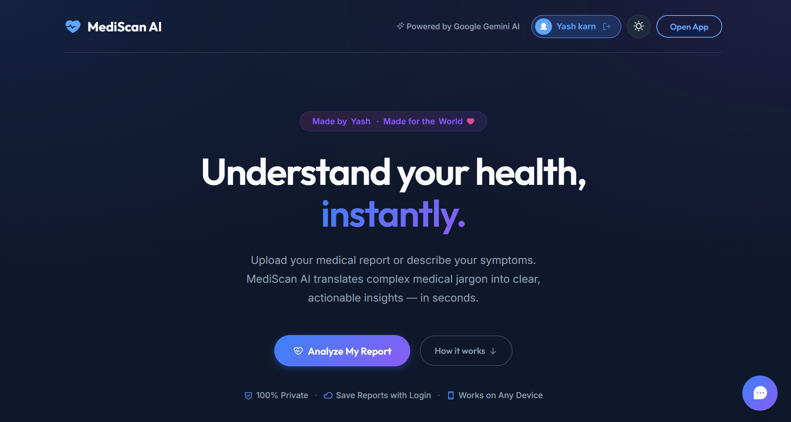
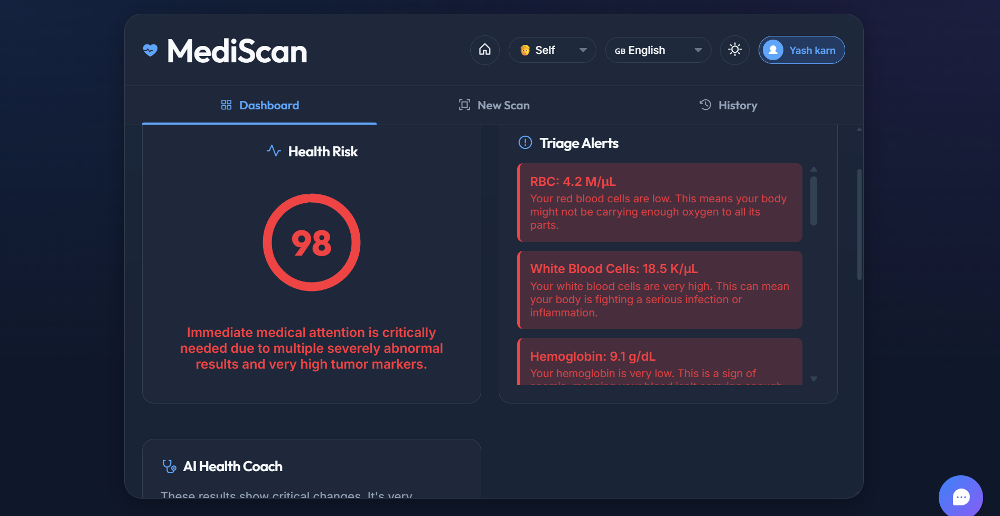

# 🏥 MediScan AI
> Understand your health, instantly.

[](https://ai.google.dev)
[](https://firebase.google.com)
[](#)

MediScan AI analyzes medical lab reports using Google Gemini AI — extracting biomarkers, validating them against **30+ clinical reference ranges**, and explaining results in plain, jargon-free language. Supports 20+ languages.

---

## 📸 Screenshots

### Landing Page


### Dashboard — Triage Alerts & Risk Score


---

## ✨ Features

| Feature | Description |
|---|---|
| 🔬 **AI Report Analysis** | Upload PDF or image → structured biomarker extraction via Gemini |
| 🚨 **Smart Triage** | Flags Critical / Attention / Monitor / Normal with color coding |
| ✅ **Client-Side Validation** | AI output cross-checked against 30+ medical reference ranges |
| 📊 **Interactive Dashboard** | Risk score ring, triage alerts, health coaching |
| 🤖 **AI Chat Assistant** | Ask follow-up questions about your results |
| 🌍 **20+ Languages** | Hindi, Spanish, French, Arabic, Japanese, and more |
| 🔒 **Privacy-First** | Reports sent to Gemini only — never stored on any server |
| 👨‍👩‍👧 **Family Profiles** | Track reports for Self, Mother, Father, Child |
| 📄 **PDF Export** | Clean downloadable summary report |
| 🔊 **Voice I/O** | Speak symptoms, listen to your summary |

---

## 🧠 How It Works
Upload medical report (PDF / Image)
↓
Gemini AI extracts structured biomarker data
↓
validateAIOutput() cross-checks 30+ clinical reference ranges
↓
Risk score + triage levels assigned
↓
Interactive dashboard + charts rendered


---

## 🛡️ Security Model

| Layer | Implementation |
|---|---|
| **Gemini API Key** | User-entered → `localStorage` only. Never in source code. |
| **Firestore Rules** | User-scoped: `request.auth.uid == userId`. Default deny. |
| **XSS Prevention** | `escapeHTML()` on all user-injected DOM content |
| **Rate Limiting** | 5-second cooldown between API calls |
| **Response Caching** | LRU cache prevents duplicate API costs |
| **Input Validation** | AI output overridden when it conflicts with reference ranges |

---

## 🛠️ Tech Stack

| Layer | Technology |
|---|---|
| Frontend | HTML5, CSS3, Vanilla JavaScript |
| AI | Google Gemini 2.5 Flash |
| Auth & Database | Firebase Authentication + Firestore |
| Charts | Chart.js |
| Hosting | Firebase Hosting |

---

## 🚀 Run Locally

**You'll need:** A free [Gemini API key](https://aistudio.google.com/apikey) (takes 2 minutes)

```bash
git clone https://github.com/Yash-AI-ML/Mediscan-AI.git
cd Mediscan-AI
npx serve .
```

Open `http://localhost:3000` → Enter your Gemini API key → Upload a report.

---

## ⚠️ Disclaimer

MediScan AI is an **educational portfolio project**. It is not a licensed medical device and does not provide medical advice. Always consult a qualified physician. See [TERMS.md](TERMS.md) for full details.

---

## 🔮 Roadmap

- [ ] Firebase Functions backend (server-side Gemini calls)
- [ ] Real email OTP via SendGrid
- [ ] Unit tests with Jest
- [ ] TypeScript migration
- [ ] Offline support via Service Worker

---

*Built by **Yash** · 2nd semester B.Tech AIML · Made for the World ❤️*
